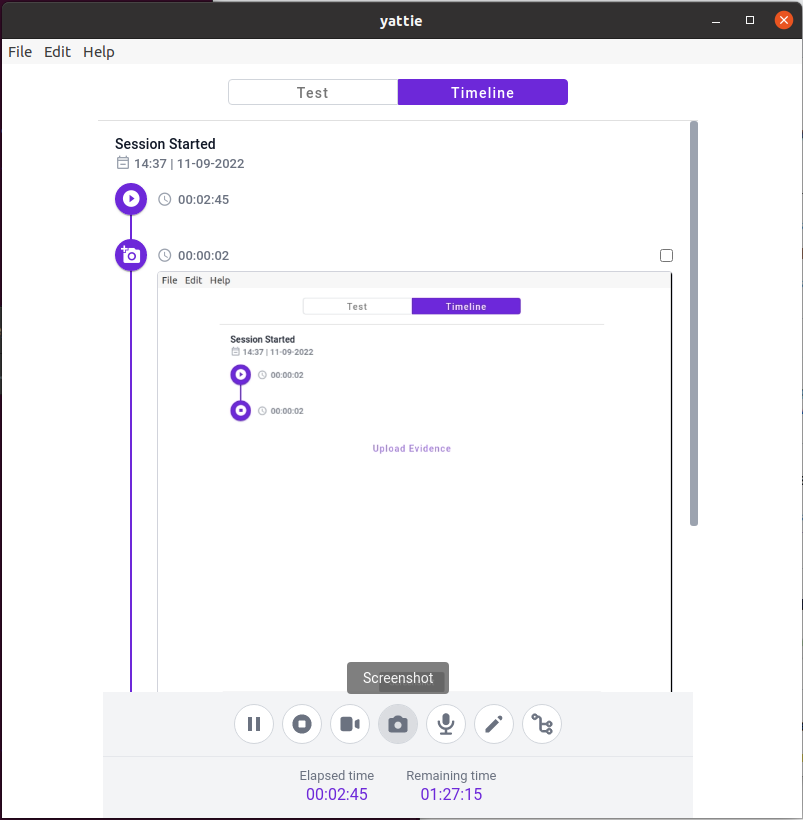

<h1 align="center">
  
</h1>

  YATTIE
   
  <a href="#about"><strong>Explore the screenshots »</strong></a>
   
   
  <a href="https://github.com/dacoaster/yattie/issues/new?assignees=&labels=bug&template=01_BUG_REPORT.md&title=bug%3A+">Report a Bug</a>
  ·
  <a href="https://github.com/dacoaster/yattie/issues/new?assignees=&labels=enhancement&template=02_FEATURE_REQUEST.md&title=feat%3A+">Request a Feature</a>
  .
  <a href="https://github.com/dacoaster/yattie/issues/new?assignees=&labels=question&template=04_SUPPORT_QUESTION.md&title=support%3A+">Ask a Question</a>

 

Table of Contents

- [About](#about)
  - [Contributors](#contributors)
  - [Built With](#built-with)
- [Getting Started](#getting-started)
  - [Prerequisites](#prerequisites)
  - [Installation](#installation)
- [Usage](#usage)
- [Roadmap](#roadmap)
- [Support](#support)
- [Project assistance](#project-assistance)
- [Contributing](#contributing)
- [Authors & contributors](#authors--contributors)
- [Security](#security)
- [License](#license)
- [Acknowledgements](#acknowledgements)

---

## About

**BETA** - *YATTIE is just getting started - please report any and all bugs you find. Likewise, contributions to the code to fix issues are always appreciated!*

YATTIE exists to help make tester's lives easier.  Ideally, it should remove friction from the exploratory process - everywhere from gathering evidence to submitting reports.

Our view is that testing is an art as varied and complex as those who undertake it.  So our goal is to create a flexible, extensible toolset to raise the bar for what each member of the testing community can accomplish.

If you have an idea about how we can better meet that goal, please let us know by [requesting a feature](https://github.com/dacoaster/yattie/labels/enhancement) or, better yet, [put in a pull request!](docs/CONTRIBUTING.md).

Screenshots

 

|                               Test Charter                               |                               Test Timeline                               |
| :-------------------------------------------------------------------: | :--------------------------------------------------------------------: |
|  |  |

### Contributors
Many thanks to all of the testers and developers who have contributed to YATTIE via bug reports, code, ideas, and more!

[@parwalrahul](https://github.com/parwalrahul)
[@narkhedeshubham](https://github.com/narkhedeshubham)
[@anakhavviswanathan](https://github.com/anakhavviswanathan)
[@jimholmes](https://github.com/jimholmes)
[@dacoaster](https://github.com/dacoaster)

### Built With

## Getting Started

### Prerequisites

If you looking to contribute - please checkout the [contributing guidelines](docs/CONTRIBUTING.md).

If you're just looking to take it for a spin, check out the pre-built [packages](https://yatt.ai/downloads) and find the one built for your platform.  Can't find the platform you're looking for? Let us know you'd like a new one supported by submitting a [feature requests](https://github.com/dacoaster/yattie/labels/enhancement)!

### Installation

TODO - This section could use some love (and screenshots!)

## Usage

- You can find a quick waklthrough by the very helpful @parwalrahul at the excellent MoT community [here](https://www.ministryoftesting.com/articles/acfa4d56)!
- Check out our [docs](https://docs.yattie.ai).  Note: these docs are rough and need a lot of work.

## Roadmap

See the [open issues](https://github.com/dacoaster/yattie/issues) for a list of known issues.
See the [open feature requests](https://github.com/dacoaster/yattie/labels/enhancement) for a list of current feature requests.

- [Top Feature Requests](https://github.com/dacoaster/yattie/labels/enhancement) (Add your votes using the a thumbs up or down!)
- [Top Bugs](https://github.com/dacoaster/yattie/issues?q=is%3Aissue+is%3Aopen+label%3Abug+sort%3Areactions-%2B1-desc) (Add your votes using the 👍 reaction)
- [Newest Bugs](https://github.com/dacoaster/yattie/issues?q=is%3Aopen+is%3Aissue+label%3Abug)

## Support

Reach out to the maintainer at one of the following places:

- [GitHub issues](https://github.com/dacoaster/yattie/issues/new?assignees=&labels=question&template=04_SUPPORT_QUESTION.md&title=support%3A+)
- Contact options listed on [this GitHub profile](https://github.com/dacoaster)

## Project assistance

If you want to say **thank you** or/and support active development of YATTIE:

- Add a [GitHub Star](https://github.com/dacoaster/yattie) to the project.
- Tweet about YATTIE.
- Fill out our [user survey](https://yatt.ai/yattie-survey) so we can improve YATTIE!
- Write interesting articles about the project on [Dev.to](https://dev.to/), [Medium](https://medium.com/) or your personal blog.

Together, we can make YATTIE **better**!

## Contributing

First off, thanks for taking the time to contribute! Contributions are what make the open-source community such an amazing place to learn, inspire, and create. Any contributions you make will benefit everybody else and are **greatly appreciated**.

Please read [our contribution guidelines](docs/CONTRIBUTING.md), and thank you for being involved!

## Authors & contributors

The original setup of this repository is by [David Acosta](https://github.com/dacoaster).

For a full list of all authors and contributors, see [the contributors page](https://github.com/dacoaster/yattie/contributors).

## Security

YATTIE follows good practices of security, but 100% security cannot be assured.
YATTIE is provided **"as is"** without any **warranty**. Use at your own risk.

_For more information and to report security issues, please refer to our [security documentation](docs/SECURITY.md)._

## License

This project is licensed under the **GPLv3 license**.

See [LICENSE](LICENSE) for more information.

## Acknowledgements

Many thanks to the kind folks over on the [Ministry of Testing forums](https://club.ministryoftesting.com) for their ideas, feedback, and willingness to help!
